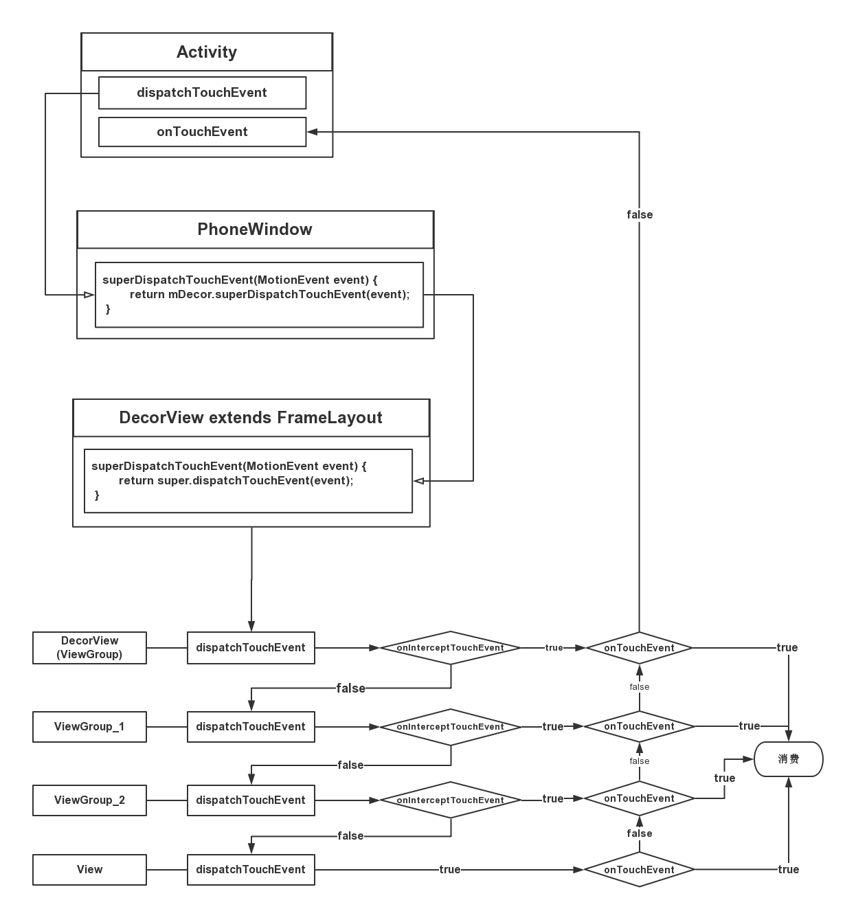

### Android 中 Input 事件的完整流程分析

> 作为一名 Android 的开发者，TouchEvent 应该是最熟悉不过的吧， 几乎所有的操作都是通过手指按压或滑动屏幕完成的。今天我们就来了解下从手指按压屏幕到按钮做出响应，中间都经历了哪些？

首先先来看 Input 事件的大致流程：

**Linux Kernel -> IMS(InputReader -> InputDispatcher) -> WMS -> ViewRootImpl -> Activity -> View**

我们这次把流程拆分成三部分来分析：
1. Linux Kernel -> IMS(InputReader -> InputDispatcher) -> WMS
2. WMS -> ViewRootImpl -> Activity
3. Activity -> ViewGroup -> View

平时开发过程中最熟悉的是从 Activity 开始的第三部分，这一部分可以绘制一个很熟悉的流程图，如下：

那和 Activity 关系也很密切的 **Part 2**，以及偏向底层（驱动层、Native层）的 **Part 1** 是否也可以绘制一个类似的流程图？

答案是肯定的，由我来带着大家逐步揭开 Input 系统的面纱，最终绘制出最完整的流程图。
