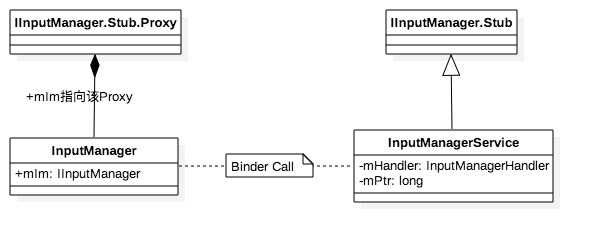

### Android 中 Touch 事件的生命轮回

> 作为一名 Android 的开发者，TouchEvent 应该是最熟悉不过的吧， 几乎所有的操作都是通过手指按压或滑动屏幕完成的。今天我们就来了解下从手指按压屏幕到按钮做出响应，中间都经历了哪些？

首先，先来拆分下问题，UI 开发都是基于 Activity 的，自然而然我们处理的 Touch 事件都源自 Activity 的 dispatchTouchEvent 方法。 那好，我们可以划分下范围
* Activity 接收到 Touch 事件之后的给各 ViewGroup、View 的分发流程
* WindowManagerService 传递 Window 上接收的事件给 Activity 的流程
* 驱动层或者说 Native 层把 TouchEvent 发送给 InputManagerService 最后发给 WindowManagerService 的流程


要说 Android 的输入系统，首先是 InputManagerService 也就是 IMS ，那 IMS 的启动是在哪里呢？ Zygote 的启动核心 main 方法在 SystemServer 中

#### SystemServer.main
```java
/**
 * The main entry point from zygote.
 */
public static void main(String[] args) {
    new SystemServer().run();
}
```
#### SystemServer.run
```java
private void run() {
  ...
  省略一堆代码
  ...

  // Initialize the system context.
   createSystemContext();

   // Create the system service manager.
   mSystemServiceManager = new SystemServiceManager(mSystemContext);
   LocalServices.addService(SystemServiceManager.class, mSystemServiceManager);

  // Start services.
  try {
      Trace.traceBegin(Trace.TRACE_TAG_SYSTEM_SERVER, "StartServices");
      startBootstrapServices();
      startCoreServices(); //启动核心服务
      startOtherServices(); //启动其他服务
  } catch (Throwable ex) {
      Slog.e("System", "******************************************");
      Slog.e("System", "************ Failure starting system services", ex);
      throw ex;
  } finally {
      Trace.traceEnd(Trace.TRACE_TAG_SYSTEM_SERVER);
  }

  ...

}
```
#### SystemServer.startOtherServices
```java
/**
  * Starts a miscellaneous grab bag of stuff that has yet to be refactored
  * and organized.
  */
 private void startOtherServices() {
   ...
   省略一堆代码
   ...

   inputManager = new InputManagerService(context);
   Trace.traceEnd(Trace.TRACE_TAG_SYSTEM_SERVER);

   wm = WindowManagerService.main(context, inputManager,
           mFactoryTestMode != FactoryTest.FACTORY_TEST_LOW_LEVEL,
           !mFirstBoot, mOnlyCore);
   ServiceManager.addService(Context.WINDOW_SERVICE, wm);
   ServiceManager.addService(Context.INPUT_SERVICE, inputManager);

   mSystemServiceManager.startService(VrManagerService.class);
   Trace.traceEnd(Trace.TRACE_TAG_SYSTEM_SERVER);

   mActivityManagerService.setWindowManager(wm);

   inputManager.setWindowManagerCallbacks(wm.getInputMonitor());
   inputManager.start();

 }
```
接下来我们来看一下 InputManagerService 的构造方法
```java

public InputManagerService(Context context) {
    this.mContext = context;
    //运行在线程 “android.display”
    this.mHandler = new InputManagerHandler(DisplayThread.get().getLooper());

    ...

    //初始化Native对象
    mPtr = nativeInit(this, mContext, mHandler.getLooper().getQueue());

    LocalServices.addService(InputManagerInternal.class, new LocalService());
}
```
InputManagerService 继承于 IInputManager.Stub， 作为 Binder 服务端，Client 位于 InputManager 的内部通过 IInputManager.Stub.asInterface() 获取 Binder 代理端，C/S 两端通信的协议是由 IInputManager.aidl 来定义的。

#### InputManager.java
```java
private static InputManager sInstance;
private final IInputManager mIm;

private InputManager(IInputManager im) {
    mIm = im;
}

/**
* Gets an instance of the input manager.
*
* @return The input manager instance.
*
* @hide
*/
public static InputManager getInstance() {
  synchronized (InputManager.class) {
      if (sInstance == null) {
          IBinder b = ServiceManager.getService(Context.INPUT_SERVICE);
          sInstance = new InputManager(IInputManager.Stub.asInterface(b));
      }
      return sInstance;
  }
}
```

我们继续看 InputManagerService 的构造方法，其中
```java
mPtr = nativeInit(this, mContext, mHandler.getLooper().getQueue())
```
成员变量 mPtr 指向 Native 层的 NativeInputManager 对象
#### nativeInit
[com_android_server_input_InputManagerService.cpp]
```c
static jlong nativeInit(JNIEnv* env, jclass /* clazz */, jobject serviceObj, jobject contextObj, jobject messageQueueObj) {
    //获取native消息队列
    sp<MessageQueue> messageQueue = android_os_MessageQueue_getMessageQueue(env, messageQueueObj);
    ...
    //创建Native的InputManager
    NativeInputManager* im = new NativeInputManager(contextObj, serviceObj,
            messageQueue->getLooper());
    im->incStrong(0);
    return reinterpret_cast<jlong>(im); //返回Native对象的指针
}
```
接着跟进去 NativeInputManager 的构造
[com_android_server_input_InputManagerService.cpp]
```c
NativeInputManager::NativeInputManager(jobject contextObj,
        jobject serviceObj, const sp<Looper>& looper) :
        mLooper(looper), mInteractive(true) {
    JNIEnv* env = jniEnv();

    mContextObj = env->NewGlobalRef(contextObj);//应用层IMS的context
    mServiceObj = env->NewGlobalRef(serviceObj);//应用层IMS对象

    ...

    sp<EventHub> eventHub = new EventHub(); //创建EventHub对象
    mInputManager = new InputManager(eventHub, this, this);//创建Native层的InputManager对象
}
```
可以看到构造方法中主要是创建了 EventHub 对象和 Native 层的 InputManager 对象，接下来我们接着看一下 EventHub 和 InputManager 都做了什么
#### EventHub
[EventHub.cpp]
```c

static const char *DEVICE_PATH = "/dev/input";

EventHub::EventHub(void) :
        mBuiltInKeyboardId(NO_BUILT_IN_KEYBOARD), mNextDeviceId(1), mControllerNumbers(),
        mOpeningDevices(0), mClosingDevices(0),
        mNeedToSendFinishedDeviceScan(false),
        mNeedToReopenDevices(false), mNeedToScanDevices(true),
        mPendingEventCount(0), mPendingEventIndex(0), mPendingINotify(false) {
    acquire_wake_lock(PARTIAL_WAKE_LOCK, WAKE_LOCK_ID);
    //创建epoll
    mEpollFd = epoll_create(EPOLL_SIZE_HINT);

    mINotifyFd = inotify_init();
    //此处DEVICE_PATH为"/dev/input"，监听该设备路径
    int result = inotify_add_watch(mINotifyFd, DEVICE_PATH, IN_DELETE | IN_CREATE);

    //添加INotify到epoll实例
    result = epoll_ctl(mEpollFd, EPOLL_CTL_ADD, mINotifyFd, &eventItem);

    int wakeFds[2];
    result = pipe(wakeFds); //创建管道

    mWakeReadPipeFd = wakeFds[0];
    mWakeWritePipeFd = wakeFds[1];

    //将pipe的读和写都设置为非阻塞方式
    result = fcntl(mWakeReadPipeFd, F_SETFL, O_NONBLOCK);
    result = fcntl(mWakeWritePipeFd, F_SETFL, O_NONBLOCK);

    eventItem.data.u32 = EPOLL_ID_WAKE;
    //添加管道的读端到epoll实例
    result = epoll_ctl(mEpollFd, EPOLL_CTL_ADD, mWakeReadPipeFd, &eventItem);
    ...
}
```
该方法主要功能：

* 初始化INotify（监听”/dev/input”），并添加到epoll实例
* 创建非阻塞模式的管道，并添加到epoll;

#### InputManager.cpp
```c
InputManager::InputManager(
        const sp<EventHubInterface>& eventHub,
        const sp<InputReaderPolicyInterface>& readerPolicy,
        const sp<InputDispatcherPolicyInterface>& dispatcherPolicy) {
    //创建InputDispatcher对象
    mDispatcher = new InputDispatcher(dispatcherPolicy);
    //创建InputReader对象
    mReader = new InputReader(eventHub, readerPolicy, mDispatcher);
    initialize();
}
```
在 NativeInputManager 的初始化方法中我们看到，这里 InputDispatcher 和 InputReader 的 mPolicy 成员变量都指的是 NativeInputManager

#### InputDispatcher.cpp
```c
InputDispatcher::InputDispatcher(const sp<InputDispatcherPolicyInterface>& policy) :
    mPolicy(policy),
    mPendingEvent(NULL), mLastDropReason(DROP_REASON_NOT_DROPPED),
    mAppSwitchSawKeyDown(false), mAppSwitchDueTime(LONG_LONG_MAX),
    mNextUnblockedEvent(NULL),
    mDispatchEnabled(false), mDispatchFrozen(false), mInputFilterEnabled(false) {

    //创建 Looper 对象
    mLooper = new Looper(false);

    mKeyRepeatState.lastKeyEntry = NULL;
    //获得分发的参数配置
    policy->getDispatcherConfiguration(&mConfig);
}
```
上面刚刚提到这里的 policy 指向的是 NativeInputManager 对象，那么 getDispatcherConfiguration 方法在 com_android_server_input_InputManagerService.cpp 中
```c
void NativeInputManager::getDispatcherConfiguration(InputDispatcherConfiguration* outConfig) {
    JNIEnv* env = jniEnv();

    //从 IMS 中获取 keyRepeatTimeout
    jint keyRepeatTimeout = env->CallIntMethod(mServiceObj,
            gServiceClassInfo.getKeyRepeatTimeout);
    if (!checkAndClearExceptionFromCallback(env, "getKeyRepeatTimeout")) {
      //设置 keyRepeatTimeout
        outConfig->keyRepeatTimeout = milliseconds_to_nanoseconds(keyRepeatTimeout);
    }
    //从 IMS 中获取 keyRepeatDelay
    jint keyRepeatDelay = env->CallIntMethod(mServiceObj,
            gServiceClassInfo.getKeyRepeatDelay);
    if (!checkAndClearExceptionFromCallback(env, "getKeyRepeatDelay")) {
      //设置 keyRepeatDelay
        outConfig->keyRepeatDelay = milliseconds_to_nanoseconds(keyRepeatDelay);
    }
}
```

#### InputReader.cpp
```c
InputReader::InputReader(const sp<EventHubInterface>& eventHub,
        const sp<InputReaderPolicyInterface>& policy,
        const sp<InputListenerInterface>& listener) :
        mContext(this), mEventHub(eventHub), mPolicy(policy),
        mGlobalMetaState(0), mGeneration(1),
        mDisableVirtualKeysTimeout(LLONG_MIN), mNextTimeout(LLONG_MAX),
        mConfigurationChangesToRefresh(0) {
    // 创建输入监听对象
    mQueuedListener = new QueuedInputListener(listener);
    {
        AutoMutex _l(mLock);
        refreshConfigurationLocked(0);
        updateGlobalMetaStateLocked();
    }
}
```
此处 mQueuedListener 的成员变量 mInnerListener 便是 InputDispatcher 对象。 InputManager 创建完 InputDispatcher 和 InputReader 对象， 接下里便是调用 initialize 初始化

#### initialize
[InputManager.cpp]
```c
void InputManager::initialize() {
    //创建线程“InputReader”
    mReaderThread = new InputReaderThread(mReader);
    //创建线程”InputDispatcher“
    mDispatcherThread = new InputDispatcherThread(mDispatcher);
}
```
[InputReader.cpp]
```c
InputReaderThread::InputReaderThread(const sp<InputReaderInterface>& reader) :
        Thread(/*canCallJava*/ true), mReader(reader) {
}
```
[InputDispatcher.cpp]
```c
InputDispatcherThread::InputDispatcherThread(const sp<InputDispatcherInterface>& dispatcher) :
        Thread(/*canCallJava*/ true), mDispatcher(dispatcher) {
}
```
初始化的主要工作就是创建两个能访问 Java 层的 native 线程。

* 创建 InputReader 线程
* 创建 InputDispatcher 线程

到这里整个的 InputManagerService 对象初始化过程已完成，接下来便是调用其 start 方法。

#### IMS.start()
[InputManagerService.java]
```java
public void start() {
    Slog.i(TAG, "Starting input manager");
    nativeStart(mPtr);

    ...

}
```
start 方法比较简单，主要是调用 nativeStart 方法
#### nativeStart
[com_android_server_input_InputManagerService.cpp]
```c
static void nativeStart(JNIEnv* env, jclass /* clazz */, jlong ptr) {
    //此处ptr记录的是NativeInputManager
    NativeInputManager* im = reinterpret_cast<NativeInputManager*>(ptr);
    //调用 InputManager 的 start 方法
    status_t result = im->getInputManager()->start();
    ...
}
```
#### InputManager.start
[InputManager.cpp]
```c
status_t InputManager::start() {
    result = mDispatcherThread->run("InputDispatcher", PRIORITY_URGENT_DISPLAY);
    result = mReaderThread->run("InputReader", PRIORITY_URGENT_DISPLAY);
    ...
    return OK;
}
```
这里主要做的是启动在init的时候创建的两个线程
* 启动 InputDispatcher 线程
* 启动 InputReader 线程

### 总结一下
#### 分层视角：

1. Java 层 InputManagerService：采用 android.display 线程处理 Message.
2. JNI 的 NativeInputManager：采用 android.display 线程处理 Message,以及创建 EventHub。
3. Native 的 InputManager：创建 InputReaderThread和 InputDispatcherThread 两个线程

#### 主要功能：

* IMS服务中的成员变量mPtr记录Native层的NativeInputManager对象；
* IMS对象的初始化过程的重点在于native初始化，分别创建了以下对象：
  + NativeInputManager；
  + EventHub, InputManager；
  + InputReader，InputDispatcher；
  + InputReaderThread，InputDispatcherThread
* IMS启动过程的主要功能是启动以下两个线程：
  + InputReader：从EventHub取出事件并处理，再交给InputDispatcher
  + InputDispatcher：接收来自InputReader的输入事件，并派发事件到合适的窗口。

从整个启动过程，可以看到 system_server 进程中有3个线程跟 Input 输入系统息息相关，分别是 android.display, InputReader,InputDispatcher。


Input事件流程：Linux Kernel -> IMS(InputReader -> InputDispatcher) -> WMS -> ViewRootImpl， 后续再进一步介绍。
