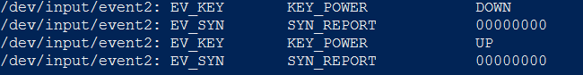
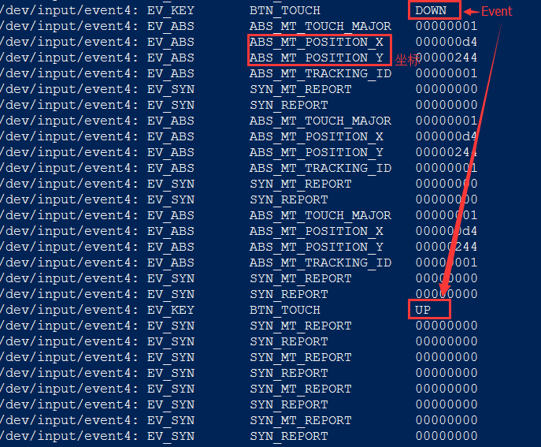

demo 的布局如下图


代码只是重新了 dispatchTouchEvent  onInterceptTouchEvent onTouchEvent, 但实现都是直接调用 super 的操作

#### 一、点击Button按钮

```java
I/Activity: dispatchTouchEvent action = Down
I/LinearLayout: [188204132] dispatchTouchEvent action = Down
I/LinearLayout: [188204132] onInterceptTouchEvent action = Down
I/LinearLayout: [188204132] onInterceptTouchEvent action = Down, ret = false
I/Button: dispatchTouchEvent action = Down
I/Button: onTouchEvent action = Down
I/Button: onTouchEvent action = Down  ret = true
I/Button: dispatchTouchEvent action = Down  ret = true
I/LinearLayout: [188204132] dispatchTouchEvent action = Down, ret = true
I/Activity: dispatchTouchEvent action = Down ret = true
I/Activity: dispatchTouchEvent action = Up
I/LinearLayout: [188204132] dispatchTouchEvent action = Up
I/LinearLayout: [188204132] onInterceptTouchEvent action = Up
I/LinearLayout: [188204132] onInterceptTouchEvent action = Up, ret = false
I/Button: dispatchTouchEvent action = Up
I/Button: onTouchEvent action = Up
I/Button: onTouchEvent action = Up  ret = true
I/Button: dispatchTouchEvent action = Up  ret = true
I/LinearLayout: [188204132] dispatchTouchEvent action = Up, ret = true
I/Activity: dispatchTouchEvent action = Up ret = true
I/Button: performClick
I/Activity: btn onClick
```
可以看到 LinearLayout 没有拦截 Touch 事件，传递到最后的子view也就是Button， Button 的 onTouchEvent 返回 true 表示处理了此次 Touch 事件，然后可以看到事件顺着 dispatchTouch 的路线一路回到了最上层Activity的dispatchTouch

#### 二、点击TextView
```java
I/Activity: dispatchTouchEvent action = Down
I/LinearLayout: [188204132] dispatchTouchEvent action = Down
I/LinearLayout: [188204132] onInterceptTouchEvent action = Down
I/LinearLayout: [188204132] onInterceptTouchEvent action = Down, ret = false
I/MyTextView: dispatchTouchEvent Down
I/MyTextView: onTouchEvent action = Down
I/MyTextView: onTouchEvent action = Down  ret = false
I/MyTextView: dispatchTouchEvent Down, ret = false
I/LinearLayout: [188204132] onTouchEvent action = Down
I/LinearLayout: [188204132] onTouchEvent action = Down, ret = false
I/LinearLayout: [188204132] dispatchTouchEvent action = Down, ret = false
I/Activity: onTouchEvent action = Down
I/Activity: onTouchEvent action = Down ret = false
I/Activity: dispatchTouchEvent action = Down ret = false
I/Activity: dispatchTouchEvent action = Up
I/Activity: onTouchEvent action = Up
I/Activity: onTouchEvent action = Up ret = false
I/Activity: dispatchTouchEvent action = Up ret = false
```
可以看到TextView作为ViewHierarchy的最后一个节点，并没有消费此次Touch事件，而是又沿着原路径返回到Activity，而最后Activity的onTouchEvent也没有消费，相当于此次Touch实现最终被丢弃。

#### 三、两层LinearLayout

##### 点击Button
```java
I/Activity: dispatchTouchEvent action = Down
I/LinearLayout: [188204132] dispatchTouchEvent action = Down
I/LinearLayout: [188204132] onInterceptTouchEvent action = Down
I/LinearLayout: [188204132] onInterceptTouchEvent action = Down, ret = false
I/LinearLayout: [233653965] dispatchTouchEvent action = Down
I/LinearLayout: [233653965] onInterceptTouchEvent action = Down
I/LinearLayout: [233653965] onInterceptTouchEvent action = Down, ret = false
I/Button: dispatchTouchEvent action = Down
I/Button: onTouchEvent action = Down
I/Button: onTouchEvent action = Down  ret = true
I/Button: dispatchTouchEvent action = Down  ret = true
I/LinearLayout: [233653965] dispatchTouchEvent action = Down, ret = true
I/LinearLayout: [188204132] dispatchTouchEvent action = Down, ret = true
I/Activity: dispatchTouchEvent action = Down ret = true
I/Activity: dispatchTouchEvent action = Up
I/LinearLayout: [188204132] dispatchTouchEvent action = Up
I/LinearLayout: [188204132] onInterceptTouchEvent action = Up
I/LinearLayout: [188204132] onInterceptTouchEvent action = Up, ret = false
I/LinearLayout: [233653965] dispatchTouchEvent action = Up
I/LinearLayout: [233653965] onInterceptTouchEvent action = Up
I/LinearLayout: [233653965] onInterceptTouchEvent action = Up, ret = false
I/Button: dispatchTouchEvent action = Up
I/Button: onTouchEvent action = Up
I/Button: onTouchEvent action = Up  ret = true
I/Button: dispatchTouchEvent action = Up  ret = true
I/LinearLayout: [233653965] dispatchTouchEvent action = Up, ret = true
I/LinearLayout: [188204132] dispatchTouchEvent action = Up, ret = true
I/Activity: dispatchTouchEvent action = Up ret = true
I/Button: performClick
I/Activity: btn onClick
```

##### 点击TextView
```java
I/Activity: dispatchTouchEvent action = Down
I/LinearLayout: [188204132] dispatchTouchEvent action = Down
I/LinearLayout: [188204132] onInterceptTouchEvent action = Down
I/LinearLayout: [188204132] onInterceptTouchEvent action = Down, ret = false
I/LinearLayout: [233653965] dispatchTouchEvent action = Down
I/LinearLayout: [233653965] onInterceptTouchEvent action = Down
I/LinearLayout: [233653965] onInterceptTouchEvent action = Down, ret = false
I/MyTextView: dispatchTouchEvent Down
I/MyTextView: onTouchEvent action = Down
I/MyTextView: onTouchEvent action = Down  ret = false
I/MyTextView: dispatchTouchEvent Down, ret = false
I/LinearLayout: [233653965] onTouchEvent action = Down
I/LinearLayout: [233653965] onTouchEvent action = Down, ret = false
I/LinearLayout: [233653965] dispatchTouchEvent action = Down, ret = false
I/LinearLayout: [188204132] onTouchEvent action = Down
I/LinearLayout: [188204132] onTouchEvent action = Down, ret = false
I/LinearLayout: [188204132] dispatchTouchEvent action = Down, ret = false
I/Activity: onTouchEvent action = Down
I/Activity: onTouchEvent action = Down ret = false
I/Activity: dispatchTouchEvent action = Down ret = false
I/Activity: dispatchTouchEvent action = Up
I/Activity: onTouchEvent action = Up
I/Activity: onTouchEvent action = Up ret = false
I/Activity: dispatchTouchEvent action = Up ret = false
```
两层LinearLayout的结果和一层是一样，可以看到是基于ViewHierarchy从顶到底的遍历

#### 四、LinearLayout 进行拦截
在 LinearLayout 的 onInterceptTouchEvent 中 return true 进行事件拦截
```java
I/Activity: dispatchTouchEvent action = Down
I/LinearLayout: [188204132] dispatchTouchEvent action = Down
I/LinearLayout: [188204132] onInterceptTouchEvent action = Down
I/LinearLayout: [188204132] onInterceptTouchEvent action = Down, ret = true
I/LinearLayout: [188204132] onTouchEvent action = Down
I/LinearLayout: [188204132] onTouchEvent action = Down, ret = false
I/LinearLayout: [188204132] dispatchTouchEvent action = Down, ret = false
I/Activity: onTouchEvent action = Down
I/Activity: onTouchEvent action = Down ret = false
I/Activity: dispatchTouchEvent action = Down ret = false
I/Activity: dispatchTouchEvent action = Up
I/Activity: onTouchEvent action = Up
I/Activity: onTouchEvent action = Up ret = false
I/Activity: dispatchTouchEvent action = Up ret = false
```
此时再次点击 Button，发现事件并没有传递给 Button，而是到 LinearLayout 之后就直接到了 LinearLayout 的 onTouchEvent，再之后就是沿着来的路返回，直到 Activity 结束


** 通过 adb shell 下的 getevent 命令可以看到输入的事件 **
```
adb shell
getevent -l
```
此时按 Power 键输出如下图:



我们再来试一下 Touch 事件：


