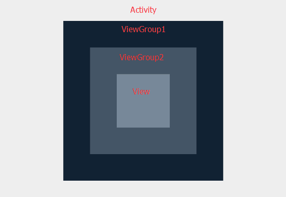

### 分析一个例子



UI 结构如上图所示，通过这个例子来分析如下几种情况
1. 默认情况，全部返回super，默认情况是不拦截不消费事件的
2. View 的 onTouchEvent() 消费 down 事件，其他默认
3. ViewGroup2 的 onTouchEvent() 消费 down 事件，其他默认
4. ViewGroup2 的 onInterceptTouchEvent() 拦截 down 之后的事件

#### 情况1 - 全部采用默认，也就是 return false
```java
I/Activity: [ dispatchTouchEvent action = Down[0]
I/ViewGroup: |--------------------ViewGroup dispatchTouchEvent begin ----------------------------|
I/ViewGroup:  dispatchTouchEvent action = Down[0]
I/ViewGroup:     onInterceptTouchEvent action = Down[0]
I/ViewGroup:     onInterceptTouchEvent action = Down[0], ret = false
I/ViewGroup2: |--------------------ViewGroup2 dispatchTouchEvent begin ----------------------------|
I/ViewGroup2:   dispatchTouchEvent action = Down[0]
I/ViewGroup2:     onInterceptTouchEvent action = Down[0]
I/ViewGroup2:    onInterceptTouchEvent action = Down[0], ret = false
I/MyTextView: [dispatchTouchEvent Down[0]
I/MyTextView: [onTouchEvent action = Down[0]
I/MyTextView: onTouchEvent action = Down[0]  ret = false]
I/MyTextView: dispatchTouchEvent Down[0], ret = false]
I/ViewGroup2:       onTouchEvent action = Down[0]
I/ViewGroup2:     onTouchEvent action = Down[0], ret = false
I/ViewGroup2:   dispatchTouchEvent action = Down[0], ret = false
I/ViewGroup2: |--------------------ViewGroup2 dispatchTouchEvent end----------------------------|
I/ViewGroup: onTouchEvent action = Down[0]
I/ViewGroup: onTouchEvent action = Down[0], ret = false
I/ViewGroup:  dispatchTouchEvent action = Down[0], ret = false
I/ViewGroup: |--------------------ViewGroup dispatchTouchEvent end----------------------------|
I/Activity: [ onTouchEvent action = Down[0]
I/Activity: onTouchEvent action = Down[0] ret = false]
I/Activity: dispatchTouchEvent action = Down[0] ret = false]
I/Activity: [ dispatchTouchEvent action = Up[1]
I/Activity: [ onTouchEvent action = Up[1]
I/Activity: onTouchEvent action = Up[1] ret = false]
I/Activity: dispatchTouchEvent action = Up[1] ret = false]
```
#### 情况2 - view 消费 down
```java
I/Activity: [ dispatchTouchEvent action = Down[0]
 I/ViewGroup: |--------------------ViewGroup dispatchTouchEvent begin ----------------------------|
 I/ViewGroup:  dispatchTouchEvent action = Down[0]
 I/ViewGroup:     onInterceptTouchEvent action = Down[0]
 I/ViewGroup:     onInterceptTouchEvent action = Down[0], ret = false
 I/ViewGroup2: |--------------------ViewGroup2 dispatchTouchEvent begin ----------------------------|
 I/ViewGroup2:   dispatchTouchEvent action = Down[0]
 I/ViewGroup2:     onInterceptTouchEvent action = Down[0]
 I/ViewGroup2:    onInterceptTouchEvent action = Down[0], ret = false
 I/Button: dispatchTouchEvent action = Down[0]
 I/Button: onTouchEvent action = Down[0]
 I/Button: onTouchEvent action = Down[0]  ret = true
 I/Button: dispatchTouchEvent action = Down[0]  ret = true
 I/ViewGroup2:   dispatchTouchEvent action = Down[0], ret = true
 I/ViewGroup2: |--------------------ViewGroup2 dispatchTouchEvent end----------------------------|
 I/ViewGroup:  dispatchTouchEvent action = Down[0], ret = true
 I/ViewGroup: |--------------------ViewGroup dispatchTouchEvent end----------------------------|
 I/Activity: dispatchTouchEvent action = Down[0] ret = true]
 I/Activity: [ dispatchTouchEvent action = Up[1]
 I/ViewGroup: |--------------------ViewGroup dispatchTouchEvent begin ----------------------------|
 I/ViewGroup:  dispatchTouchEvent action = Up[1]
 I/ViewGroup:     onInterceptTouchEvent action = Up[1]
 I/ViewGroup:     onInterceptTouchEvent action = Up[1], ret = false
 I/ViewGroup2: |--------------------ViewGroup2 dispatchTouchEvent begin ----------------------------|
 I/ViewGroup2:   dispatchTouchEvent action = Up[1]
 I/ViewGroup2:     onInterceptTouchEvent action = Up[1]
 I/ViewGroup2:    onInterceptTouchEvent action = Up[1], ret = false
 I/Button: dispatchTouchEvent action = Up[1]
 I/Button: onTouchEvent action = Up[1]
 I/Button: onTouchEvent action = Up[1]  ret = true
 I/Button: dispatchTouchEvent action = Up[1]  ret = true
 I/ViewGroup2:   dispatchTouchEvent action = Up[1], ret = true
 I/ViewGroup2: |--------------------ViewGroup2 dispatchTouchEvent end----------------------------|
 I/ViewGroup:  dispatchTouchEvent action = Up[1], ret = true
 I/ViewGroup: |--------------------ViewGroup dispatchTouchEvent end----------------------------|
 I/Activity: dispatchTouchEvent action = Up[1] ret = true]
 I/Button: performClick
```
#### 情况3 - View 消费 Down，但 ViewGroup2 拦截 up 事件
```java
I/Activity: [ dispatchTouchEvent action = Down[0]
I/ViewGroup: |--------------------ViewGroup dispatchTouchEvent begin ----------------------------|
I/ViewGroup:  dispatchTouchEvent action = Down[0]
I/ViewGroup:     onInterceptTouchEvent action = Down[0]
I/ViewGroup:     onInterceptTouchEvent action = Down[0], ret = false
I/ViewGroup2: |--------------------ViewGroup2 dispatchTouchEvent begin ----------------------------|
I/ViewGroup2:   dispatchTouchEvent action = Down[0]
I/ViewGroup2:     onInterceptTouchEvent action = Down[0]
I/ViewGroup2:    onInterceptTouchEvent action = Down[0], ret = false
I/Button: dispatchTouchEvent action = Down[0]
I/Button: onTouchEvent action = Down[0]
I/Button: onTouchEvent action = Down[0]  ret = true
I/Button: dispatchTouchEvent action = Down[0]  ret = true
I/ViewGroup2:   dispatchTouchEvent action = Down[0], ret = true
I/ViewGroup2: |--------------------ViewGroup2 dispatchTouchEvent end----------------------------|
I/ViewGroup:  dispatchTouchEvent action = Down[0], ret = true
I/ViewGroup: |--------------------ViewGroup dispatchTouchEvent end----------------------------|
I/Activity: dispatchTouchEvent action = Down[0] ret = true]
I/Activity: [ dispatchTouchEvent action = Up[1]
I/ViewGroup: |--------------------ViewGroup dispatchTouchEvent begin ----------------------------|
I/ViewGroup:  dispatchTouchEvent action = Up[1]
I/ViewGroup:     onInterceptTouchEvent action = Up[1]
I/ViewGroup:     onInterceptTouchEvent action = Up[1], ret = false
I/ViewGroup2: |--------------------ViewGroup2 dispatchTouchEvent begin ----------------------------|
I/ViewGroup2:   dispatchTouchEvent action = Up[1]
I/ViewGroup2:     onInterceptTouchEvent action = Up[1]
I/ViewGroup2:    onInterceptTouchEvent action = Up[1], ret = true
I/Button: dispatchTouchEvent action = Cancel[3]
I/Button: onTouchEvent action = Cancel[3]
I/Button: onTouchEvent action = Cancel[3]  ret = true
I/Button: dispatchTouchEvent action = Cancel[3]  ret = true
I/ViewGroup2:   dispatchTouchEvent action = Up[1], ret = true
I/ViewGroup2: |--------------------ViewGroup2 dispatchTouchEvent end----------------------------|
I/ViewGroup:  dispatchTouchEvent action = Up[1], ret = true
I/ViewGroup: |--------------------ViewGroup dispatchTouchEvent end----------------------------|
I/Activity: dispatchTouchEvent action = Up[1] ret = true]
```
