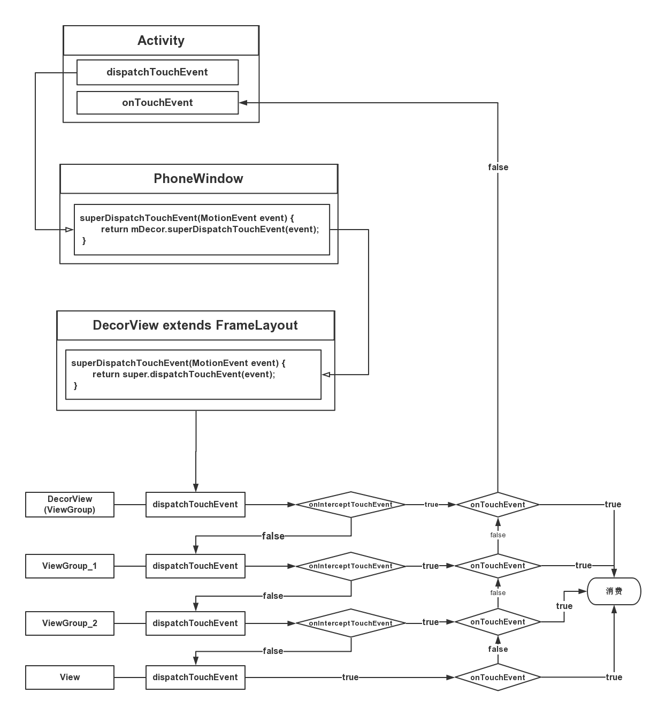

### Activity 到 ViewGroup (View) 的事件传递

我们来梳理下 Touch 事件传递涉及的一些基础：
1. 一般情况下，每一个 Touch 事件，总是以 ACTION_DOWN 事件开始，中间穿插着一些 ACTION_MOVE 事件（取决于手指是否有移动），然后以 ACTION_UP 事件结束，中间还会有 onTouch、onClick、LongClick 等事件。
2. 事件分发过程中，包括对 MotionEvent 事件的三种处理操作：
 * 分发操作：dispatchTouchEvent方法，后面两个方法都是在该方法中被调用的
  * 拦截操作：onInterceptTouchEvent 方法（ViewGroup）
  * 消费操作：onTouchEvent 方法和 OnTouchListener 的 onTouch 方法，其中 onTouch 的优先级高于 onTouchEvent，若 onTouch 返回 true，那么就不会调用 onTouchEvent 方法
3. dispatchTouchEvent 分发 Touch 事件是自顶向下，而 onTouchEvent 消费事件时自底向上，onTouchEvent 和 onIntercepteTouchEvent 都是在 dispatchTouchEvent 中被调用的。


每个 Activity 有个 Window 对象(指的就是 PhoneWindow)，PhoneWindow 中有个 DecorView，这个 DecorView 就是 Activity 的 RootView，所有在 Activity 上触发的 TouchEvent，会先派发给 DecorView 的 dispatchTouchEvent，然后由 DecorView 来决定是否往子 view 派发事件。

####Activity.dispatchTouchEvent
```java
public boolean dispatchTouchEvent(MotionEvent ev) {
    if (ev.getAction() == MotionEvent.ACTION_DOWN) {
      //如果是DOWN事件，通知做一些用户反馈的事情
        onUserInteraction();
    }
    if (getWindow().superDispatchTouchEvent(ev)) {
        return true;
    }
    return onTouchEvent(ev);
}
```
代码很简单，主要的是调用 PhoneWindow 的 superDispatchTouchEvent

#### PhoneWindow.superDispatchTouchEvent
```java
@Override
public boolean superDispatchTouchEvent(MotionEvent event) {
    return mDecor.superDispatchTouchEvent(event);
}
```
很清晰的看到是调用 DecorView 的 superDispatchTouchEvent

#### DecorView.superDispatchTouchEvent
```java
public boolean superDispatchTouchEvent(MotionEvent event) {
    return super.dispatchTouchEvent(event);
}
```
这里发现，最终是调用 DecorView 的 super.dispatchTouchEvent。DecorView 的父类是 FrameLayout，但在 FrameLayout 中找不到 dispatchTouchEvent 方法，所以会去执行 FrameLayout 父类 ViewGroup 的
 dispatchTouchEvent 方法。

 再看一眼 Activity 的 dispatchTouchEvent
```java
public boolean dispatchTouchEvent(MotionEvent ev) {
    ...
    if (getWindow().superDispatchTouchEvent(ev)) {
        return true;
    }
    return onTouchEvent(ev);
}
```
 刚刚分析了 window.superDispatchTouchEvent, 有两种结果 **True** 或者 **False**

 + 如果返回 true，说明中途有 view 消费掉了该事件，那 Activity 的 dispatchTouchEvent 也返回 true，说明该事件已经被消费掉了，不会再去执行自身的 onTouchEvent 方法；

 + 反之如果返回 false，说明没有 view 消费掉该事件，会一路回传到 Activity 中，然后调用自己的 onTouchEvent 方法

#### Activity.onTouchEvent
```java
public boolean onTouchEvent(MotionEvent event) {
  //当窗口需要关闭时，消费掉当前event
  if (mWindow.shouldCloseOnTouch(this, event)) {
      finish();
      return true;
  }

  return false;
}
```

上面我们只是从粗略的了解了 TouchEvent 从 Activity 的分发过程，接下来从 DecorView 的 super.dispatchTouchEvent 往下分析

上文提到 DecorView 的 super.dispatchTouchEvent 最终会调用其父类(FrameLayout)的父类(ViewGroup)的 dispatchTouchEvent

####ViewGroup.dispatchTouchEvent
```java
public boolean dispatchTouchEvent(MotionEvent ev) {

    ...

    boolean handled = false;
    //根据隐私策略而来决定是否过滤本次触摸事件
    //当返回 true 表示继续分发事件；当返回 flase,表示该事件应该被过滤掉，不再进行任何分发
    if (onFilterTouchEventForSecurity(ev)) {
        final int action = ev.getAction();
        final int actionMasked = action & MotionEvent.ACTION_MASK;

        // Handle an initial down.
        if (actionMasked == MotionEvent.ACTION_DOWN) {
            // Throw away all previous state when starting a new touch gesture.
            // The framework may have dropped the up or cancel event for the previous gesture
            // due to an app switch, ANR, or some other state change.
            //发生 ACTION_DOWN 事件，则取消并清除之前所有的 TouchTarget
            cancelAndClearTouchTargets(ev);
            //重置触摸状态
            resetTouchState();
        }

        // Check for interception.
        final boolean intercepted;
        //发生 ACTION_DOWN 事件或者已经发生过 ACTION_DOWN，才会进入该区域
        //只要发生过 ACTION_DOWN 则 mFirstTouchTarget != null
        if (actionMasked == MotionEvent.ACTION_DOWN || mFirstTouchTarget != null) {     
            //可通过调用 requestDisallowInterceptTouchEvent，不让父 View 拦截事件       
            final boolean disallowIntercept = (mGroupFlags & FLAG_DISALLOW_INTERCEPT) != 0;
            //判断是否允许调用拦截器
            if (!disallowIntercept) {
                //调用拦截方法
                intercepted = onInterceptTouchEvent(ev);
                ev.setAction(action); // restore action in case it was changed
            } else {
                intercepted = false;
            }
        } else {
            // There are no touch targets and this action is not an initial down
            // so this view group continues to intercept touches.
            // 当没有触摸 targets，且不是 down事件时，开始持续拦截触摸。
            intercepted = true;
        }

        ...

        TouchTarget newTouchTarget = null;
        boolean alreadyDispatchedToNewTouchTarget = false;
         //不取消事件，同时不拦截事件, 并且是Down事件才进入该区域
        if (!canceled && !intercepted) {

            ....

            if (actionMasked == MotionEvent.ACTION_DOWN
                    || (split && actionMasked == MotionEvent.ACTION_POINTER_DOWN)
                    || actionMasked == MotionEvent.ACTION_HOVER_MOVE) {
                final int actionIndex = ev.getActionIndex(); // always 0 for down
                final int idBitsToAssign = split ? 1 << ev.getPointerId(actionIndex)
                        : TouchTarget.ALL_POINTER_IDS;

                // Clean up earlier touch targets for this pointer id in case they
                // have become out of sync.
                removePointersFromTouchTargets(idBitsToAssign);

                final int childrenCount = mChildrenCount;
                if (newTouchTarget == null && childrenCount != 0) {
                    final float x = ev.getX(actionIndex);
                    final float y = ev.getY(actionIndex);
                    // Find a child that can receive the event.
                    // Scan children from front to back.
                    final ArrayList<View> preorderedList = buildTouchDispatchChildList();
                    final boolean customOrder = preorderedList == null
                            && isChildrenDrawingOrderEnabled();
                    final View[] children = mChildren;
                    for (int i = childrenCount - 1; i >= 0; i--) {
                        final int childIndex = getAndVerifyPreorderedIndex(
                                childrenCount, i, customOrder);
                        final View child = getAndVerifyPreorderedView(
                                preorderedList, children, childIndex);

                        ....
                        //如果view不可见，或者触摸的坐标点不在view的范围内，则跳过本次循环
                        if (!canViewReceivePointerEvents(child)
                                || !isTransformedTouchPointInView(x, y, child, null)) {
                            ev.setTargetAccessibilityFocus(false);
                            continue;
                        }

                        newTouchTarget = getTouchTarget(child);
                        if (newTouchTarget != null) {
                            // Child is already receiving touch within its bounds.
                            // Give it the new pointer in addition to the ones it is handling.
                            newTouchTarget.pointerIdBits |= idBitsToAssign;
                            break;
                        }

                        resetCancelNextUpFlag(child);
                        //把事件分发给子View或ViewGroup, 核心方法
                        if (dispatchTransformedTouchEvent(ev, false, child, idBitsToAssign)) {
                            // Child wants to receive touch within its bounds.
                            mLastTouchDownTime = ev.getDownTime();
                            if (preorderedList != null) {
                                // childIndex points into presorted list, find original index
                                for (int j = 0; j < childrenCount; j++) {
                                    if (children[childIndex] == mChildren[j]) {
                                        mLastTouchDownIndex = j;
                                        break;
                                    }
                                }
                            } else {
                                mLastTouchDownIndex = childIndex;
                            }
                            mLastTouchDownX = ev.getX();
                            mLastTouchDownY = ev.getY();
                            //添加 TouchTarget，自此mFirstTouchTarget！=null
                            newTouchTarget = addTouchTarget(child, idBitsToAssign);
                            alreadyDispatchedToNewTouchTarget = true;
                            break;
                        }

                        // The accessibility focus didn't handle the event, so clear
                        // the flag and do a normal dispatch to all children.
                        ev.setTargetAccessibilityFocus(false);
                    }
                    if (preorderedList != null) preorderedList.clear();
                }

                if (newTouchTarget == null && mFirstTouchTarget != null) {
                    // Did not find a child to receive the event.
                    // Assign the pointer to the least recently added target.
                    newTouchTarget = mFirstTouchTarget;
                    while (newTouchTarget.next != null) {
                        newTouchTarget = newTouchTarget.next;
                    }
                    newTouchTarget.pointerIdBits |= idBitsToAssign;
                }
            }
        }

        // Dispatch to touch targets.
        // mFirstTouchTarget赋值是在通过addTouchTarget方法获取的；
        // 只有处理ACTION_DOWN事件，才会进入addTouchTarget方法。
        // 这也正是当View没有消费ACTION_DOWN事件，则不会接收其他MOVE,UP等事件的原因
        if (mFirstTouchTarget == null) {
            // No touch targets so treat this as an ordinary view.
            //没有触摸target,则由当前ViewGroup来处理
            handled = dispatchTransformedTouchEvent(ev, canceled, null,
                    TouchTarget.ALL_POINTER_IDS);
        } else {
            // Dispatch to touch targets, excluding the new touch target if we already
            // dispatched to it.  Cancel touch targets if necessary.
            //如果View消费ACTION_DOWN事件，那么MOVE,UP等事件相继开始执行
            TouchTarget predecessor = null;
            TouchTarget target = mFirstTouchTarget;
            while (target != null) {
                final TouchTarget next = target.next;
                if (alreadyDispatchedToNewTouchTarget && target == newTouchTarget) {
                    handled = true;
                } else {
                    final boolean cancelChild = resetCancelNextUpFlag(target.child)
                            || intercepted;
                    if (dispatchTransformedTouchEvent(ev, cancelChild,
                            target.child, target.pointerIdBits)) {
                        handled = true;
                    }
                    if (cancelChild) {
                        if (predecessor == null) {
                            mFirstTouchTarget = next;
                        } else {
                            predecessor.next = next;
                        }
                        target.recycle();
                        target = next;
                        continue;
                    }
                }
                predecessor = target;
                target = next;
            }
        }

        // Update list of touch targets for pointer up or cancel, if needed.
        if (canceled
                || actionMasked == MotionEvent.ACTION_UP
                || actionMasked == MotionEvent.ACTION_HOVER_MOVE) {
            resetTouchState();
        } else if (split && actionMasked == MotionEvent.ACTION_POINTER_UP) {
            final int actionIndex = ev.getActionIndex();
            final int idBitsToRemove = 1 << ev.getPointerId(actionIndex);
            removePointersFromTouchTargets(idBitsToRemove);
        }
    }

    if (!handled && mInputEventConsistencyVerifier != null) {
        mInputEventConsistencyVerifier.onUnhandledEvent(ev, 1);
    }
    return handled;
}

```
是不是一脸懵逼，是不是有点佩服 Google 的工程师们，其实简单来说 dispatchTouchEvent 主要功能就是判断是否需要拦截，需要拦截执行 onTouchEvent，不需要拦截就把 Event 分发给 child 处理

#### onInterceptTouchEvent
```java
public boolean onInterceptTouchEvent(MotionEvent ev) {
    return false;
}
```
+ ViewGroup 的默认实现是 return false
+ 当返回 true 时，表示事件被当前 ViewGroup 拦截
+ 当返回 false 时，事件继续往下进行分发

</br>
核心处理方法是 dispatchTouchEvent 中调用的 dispatchTransformedTouchEvent

#### ViewGroup.dispatchTransformedTouchEvent
```java
private boolean dispatchTransformedTouchEvent(MotionEvent event, boolean cancel, View child, int desiredPointerIdBits) {
    final boolean handled;

    // 发生取消操作时，不再执行后续的任何操作
    final int oldAction = event.getAction();
    if (cancel || oldAction == MotionEvent.ACTION_CANCEL) {
        event.setAction(MotionEvent.ACTION_CANCEL);
        if (child == null) {
            handled = super.dispatchTouchEvent(event);
        } else {
            handled = child.dispatchTouchEvent(event);
        }
        event.setAction(oldAction);
        return handled;
    }

    final int oldPointerIdBits = event.getPointerIdBits();
    final int newPointerIdBits = oldPointerIdBits & desiredPointerIdBits;

    //由于某些原因，发生不一致的操作，那么将抛弃该事件
    if (newPointerIdBits == 0) {
        return false;
    }

    //分发的主要区域
    final MotionEvent transformedEvent;
    //判断预期的pointer id与事件的pointer id是否相等
    if (newPointerIdBits == oldPointerIdBits) {
        if (child == null || child.hasIdentityMatrix()) {
            if (child == null) {
                //不存在子视图时，ViewGroup调用View.dispatchTouchEvent分发事件，再调用ViewGroup.onTouchEvent来处理事件
                handled = super.dispatchTouchEvent(event);  
            } else {
                final float offsetX = mScrollX - child.mLeft;
                final float offsetY = mScrollY - child.mTop;
                event.offsetLocation(offsetX, offsetY);
                //将触摸事件分发给子ViewGroup或View;
                //如果是ViewGroup，则调用 ViewGroup.dispatchTouchEvent；
                //如果是View，则调用View.dispatchTouchEvent；
                handled = child.dispatchTouchEvent(event);

                event.offsetLocation(-offsetX, -offsetY); //调整该事件的位置
            }
            return handled;
        }
        transformedEvent = MotionEvent.obtain(event); //拷贝该事件，来创建一个新的MotionEvent
    } else {
        //分离事件，获取包含newPointerIdBits的MotionEvent
        transformedEvent = event.split(newPointerIdBits);
    }

    if (child == null) {
        //不存在子视图时，ViewGroup调用View.dispatchTouchEvent分发事件，再调用ViewGroup.onTouchEvent来处理事件
        handled = super.dispatchTouchEvent(transformedEvent);  
    } else {
        final float offsetX = mScrollX - child.mLeft;
        final float offsetY = mScrollY - child.mTop;
        transformedEvent.offsetLocation(offsetX, offsetY);
        if (! child.hasIdentityMatrix()) {
            //将该视图的矩阵进行转换
            transformedEvent.transform(child.getInverseMatrix());
        }
        //将触摸事件分发给子ViewGroup或View;
        /如果是ViewGroup，; 如果是View，;
        handled = child.dispatchTouchEvent(transformedEvent);
    }

    //回收transformedEvent
    transformedEvent.recycle();
    return handled;
}
```
可以看到该方法是 ViewGroup 真正处理事件的地方，将 Event 分发给 View 来处理，过滤掉不相干的 pointer ids。当一个 ViewGroup 的 childcount == 0 时，MotionEvent 将会被分发给该 ViewGroup 自己处理。最终调用 View.dispatchTouchEvent 方法来分发事件。

#### View.dispatchTouchEvent
```java
public boolean dispatchTouchEvent(MotionEvent event) {
    ...

    final int actionMasked = event.getActionMasked();
    if (actionMasked == MotionEvent.ACTION_DOWN) {
        //在Down事件之前，如果存在滚动操作则停止。不存在则不进行操作
        stopNestedScroll();
    }

    // mOnTouchListener.onTouch优先于onTouchEvent。
    if (onFilterTouchEventForSecurity(event)) {
        //当存在OnTouchListener，且视图状态为ENABLED时，调用onTouch()方法
        ListenerInfo li = mListenerInfo;
        if (li != null && li.mOnTouchListener != null
                && (mViewFlags & ENABLED_MASK) == ENABLED
                && li.mOnTouchListener.onTouch(this, event)) {
            result = true; //如果已经消费事件，则返回True
        }
        //如果OnTouch（)没有消费Touch事件则调用OnTouchEvent()
        if (!result && onTouchEvent(event)) {
            result = true; //如果已经消费事件，则返回True
        }
    }

    if (!result && mInputEventConsistencyVerifier != null) {
        mInputEventConsistencyVerifier.onUnhandledEvent(event, 0);
    }

    // 处理取消或抬起操作
    if (actionMasked == MotionEvent.ACTION_UP ||
            actionMasked == MotionEvent.ACTION_CANCEL ||
            (actionMasked == MotionEvent.ACTION_DOWN && !result)) {
        stopNestedScroll();
    }

    return result;
}
```
1. 先由 OnTouchListener 的 OnTouch() 来处理事件，如果返回True则该事件被消费了；
2. 如果 onTouch 返回 False，则由 onTouchEvent 处理事件。

#### View.onTouchEvent
```java
public boolean onTouchEvent(MotionEvent event) {
    final float x = event.getX();
    final float y = event.getY();
    final int viewFlags = mViewFlags;

    // 当View状态为DISABLED，如果可点击或可长按，则返回True，即消费事件
    if ((viewFlags & ENABLED_MASK) == DISABLED) {
        if (event.getAction() == MotionEvent.ACTION_UP && (mPrivateFlags & PFLAG_PRESSED) != 0) {
            setPressed(false);
        }
        return (((viewFlags & CLICKABLE) == CLICKABLE ||
                (viewFlags & LONG_CLICKABLE) == LONG_CLICKABLE));
    }

    if (mTouchDelegate != null) {
        if (mTouchDelegate.onTouchEvent(event)) {
            return true;
        }
    }

    //当View状态为ENABLED，如果可点击或可长按，则返回True，即消费事件;
    //与前面的的结合，可得出结论:只要view是可点击或可长按，则消费该事件.
    if (((viewFlags & CLICKABLE) == CLICKABLE ||
            (viewFlags & LONG_CLICKABLE) == LONG_CLICKABLE)) {
        switch (event.getAction()) {
            case MotionEvent.ACTION_UP:
                boolean prepressed = (mPrivateFlags & PFLAG_PREPRESSED) != 0;
                if ((mPrivateFlags & PFLAG_PRESSED) != 0 || prepressed) {
                    boolean focusTaken = false;
                    if (isFocusable() && isFocusableInTouchMode() && !isFocused()) {
                        focusTaken = requestFocus();
                    }

                    if (prepressed) {
                        setPressed(true, x, y);
                   }

                    if (!mHasPerformedLongPress) {
                        //这是Tap操作，移除长按回调方法
                        removeLongPressCallback();

                        if (!focusTaken) {
                            if (mPerformClick == null) {
                                mPerformClick = new PerformClick();
                            }
                            //调用View.OnClickListener
                            if (!post(mPerformClick)) {
                                performClick();
                            }
                        }
                    }

                    if (mUnsetPressedState == null) {
                        mUnsetPressedState = new UnsetPressedState();
                    }

                    if (prepressed) {
                        postDelayed(mUnsetPressedState,
                                ViewConfiguration.getPressedStateDuration());
                    } else if (!post(mUnsetPressedState)) {
                        mUnsetPressedState.run();
                    }

                    removeTapCallback();
                }
                break;

            case MotionEvent.ACTION_DOWN:
                mHasPerformedLongPress = false;

                if (performButtonActionOnTouchDown(event)) {
                    break;
                }

                //获取是否处于可滚动的视图内
                boolean isInScrollingContainer = isInScrollingContainer();

                if (isInScrollingContainer) {
                    mPrivateFlags |= PFLAG_PREPRESSED;
                    if (mPendingCheckForTap == null) {
                        mPendingCheckForTap = new CheckForTap();
                    }
                    mPendingCheckForTap.x = event.getX();
                    mPendingCheckForTap.y = event.getY();
                    //当处于可滚动视图内，则延迟TAP_TIMEOUT，再反馈按压状态，用来判断用户是否想要滚动。默认延时为100ms
                    postDelayed(mPendingCheckForTap, ViewConfiguration.getTapTimeout());
                } else {
                    //当不再滚动视图内，则立刻反馈按压状态
                    setPressed(true, x, y);
                    checkForLongClick(0); //检测是否是长按
                }
                break;

            case MotionEvent.ACTION_CANCEL:
                setPressed(false);
                removeTapCallback();
                removeLongPressCallback();
                break;

            case MotionEvent.ACTION_MOVE:
                drawableHotspotChanged(x, y);

                if (!pointInView(x, y, mTouchSlop)) {
                    removeTapCallback();
                    if ((mPrivateFlags & PFLAG_PRESSED) != 0) {
                        removeLongPressCallback();
                        setPressed(false);
                    }
                }
                break;
        }

        return true;
    }
    return false;
}
```
到这里我们分析了 TouchEvent 从 Activity 开始到被消费的整个过程，通过下面的流程图来回顾下大致的流程：


**[完整流程](touch_lifecircle.md)揭晓**
