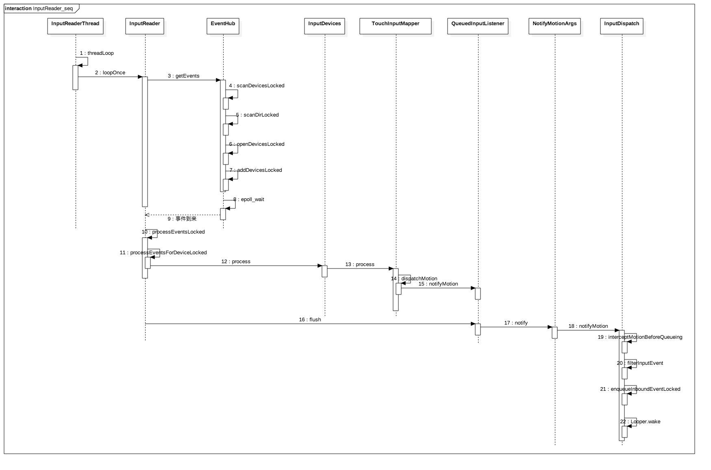

>回顾：在上一篇文章中，Native 层的 InputManager.initialize 创建了 InputReaderThread 和 InputDispatherThread 两个线程，并在 start 方法中分别启动了两个线程

### InputReader
今天从 InputReaderThread 的执行过程中的 threadLoop 为起点开始分析。
###InputReaderThread.threadLoop
[InputReader.cpp]
```c
bool InputReaderThread::threadLoop() {
    mReader->loopOnce();
    return true;
}
```
>threadLoop 返回 True 代表的是会不断地循环调用 loopOnce()，反之如果返回值为 False 时则会退出循环。

这里返回的是 True 那么整个过程就是不断循环的调用 InputReader 的 loopOnce() 方法。

#### InputReader.loopOnce
```c
void InputReader::loopOnce() {
    ...
    bool inputDevicesChanged = false;

    ...

    //从EventHub读取事件
    size_t count = mEventHub->getEvents(timeoutMillis, mEventBuffer, EVENT_BUFFER_SIZE);

    if (count) {
        processEventsLocked(mEventBuffer, count);
    }

    ...

    // Send out a message that the describes the changed input devices.
    if (inputDevicesChanged) {//输入设备发生改变
        mPolicy->notifyInputDevicesChanged(inputDevices);
    }

    //发送事件到 InputDispatcher
    mQueuedListener->flush();
}
```
EventHub 的 getEvent 是获取和转换 input_event，一起来进入代码一看究竟

在分析 getEvent 是如何获取 intput_event 之前，先来了解下 EventHub 是如何监听 /dev/input 下的设备的

#### scanDevicesLocked
```c
void EventHub::scanDevicesLocked() {
    //此处DEVICE_PATH="/dev/input"
    status_t res = scanDirLocked(DEVICE_PATH);
    ...
}
```
#### scanDirLocked
```c
status_t EventHub::scanDirLocked(const char *dirname)
{
    char devname[PATH_MAX];
    char * filename;
    DIR * dir;
    struct dirent * de;
    dir = opendir(dirname);
    if(dir == NULL)
        return -1;
    strcpy(devname, dirname);
    filename = devname + strlen(devname);
    * filename++ = '/';
    //读取/dev/input/目录下所有的设备节点
    while((de = readdir(dir))) {
        if(de->d_name[0] == '.' &&
           (de->d_name[1] == '\0' ||
            (de->d_name[1] == '.' && de->d_name[2] == '\0')))
            continue;
        strcpy(filename, de->d_name);
        //打开相应的设备节点
        openDeviceLocked(devname);
    }
    closedir(dir);
    return 0;
}
```
#### openDeviceLocked
```c
status_t EventHub::openDeviceLocked(const char *devicePath) {
    //打开设备文件
    int fd = open(devicePath, O_RDWR | O_CLOEXEC);
    //获取设备名
    if(ioctl(fd, EVIOCGNAME(sizeof(buffer) - 1), &buffer) < 1){
    } else {
        buffer[sizeof(buffer) - 1] = '\0';
        identifier.name.setTo(buffer);
    }

    ...

    Device* device = new Device(fd, deviceId, String8(devicePath), identifier);

    ...

    //注册epoll
    struct epoll_event eventItem;
    memset(&eventItem, 0, sizeof(eventItem));
    eventItem.events = EPOLLIN;
    if (mUsingEpollWakeup) {
        eventItem.events |= EPOLLWAKEUP;
    }
    eventItem.data.u32 = deviceId;
    if (epoll_ctl(mEpollFd, EPOLL_CTL_ADD, fd, &eventItem)) {
        delete device; //添加失败则删除该设备
        return -1;
    }

    ...

    addDeviceLocked(device);
}
```
#### addDeviceLocked
```c
void EventHub::addDeviceLocked(Device* device) {
    mDevices.add(device->id, device); //添加到mDevices队列
    device->next = mOpeningDevices;
    mOpeningDevices = device;
}
```
由上面几个方法可以看出 EventHub 扫描和添加设备到 mDevices 队列的大概过程，接下来继续 loopOnce 中的 getEvents 方法的分析
#### EventHub.getEvents
[EventHub.cpp]
```c
size_t EventHub::getEvents(int timeoutMillis, RawEvent* buffer, size_t bufferSize) {
    ...

    struct input_event readBuffer[bufferSize];
    RawEvent* event = buffer;
    size_t capacity = bufferSize;
    bool awoken = false;
    //大循环，在遇到错误或者 timeout 或者 awoken = true 时被break
    for (;;) {
        ...

        // Grab the next input event.
        bool deviceChanged = false;
        while (mPendingEventIndex < mPendingEventCount) {

          省略一堆代码 ...

        }

        // readNotify() will modify the list of devices so this must be done after
        // processing all other events to ensure that we read all remaining events
        // before closing the devices.
        if (mPendingINotify && mPendingEventIndex >= mPendingEventCount) {
            mPendingINotify = false;
            readNotifyLocked();
            deviceChanged = true;
        }

        // Report added or removed devices immediately.
        if (deviceChanged) {
            continue;
        }

        // Return now if we have collected any events or if we were explicitly awoken.
        if (event != buffer || awoken) {
            break;
        }

        mPendingEventIndex = 0;

        mLock.unlock(); // release lock before poll, must be before release_wake_lock
        release_wake_lock(WAKE_LOCK_ID);

        //epoll_wait 等待事件触发，当超过 timeout 还没有事件触发时就超时
        //如果有事件触发，事件集合在 mPendingEventItems 中
        //返回值是监听到的事件个数
        int pollResult = epoll_wait(mEpollFd, mPendingEventItems, EPOLL_MAX_EVENTS, timeoutMillis);

        acquire_wake_lock(PARTIAL_WAKE_LOCK, WAKE_LOCK_ID);
        mLock.lock(); // reacquire lock after poll, must be after acquire_wake_lock

        if (pollResult == 0) { // epoll_wait 返回值等于 0 表示超时
            // Timed out.
            mPendingEventCount = 0;
            break;
        }

        if (pollResult < 0) { // epoll_wait 返回值小于 0 表示出错了
            mPendingEventCount = 0;

            // Sleep after errors to avoid locking up the system.
            // Hopefully the error is transient.
            if (errno != EINTR) {
                ALOGW("poll failed (errno=%d)\n", errno);
                usleep(100000);
            }
        } else {
            //监听到事件，epoll_wait 的返回值 pollResult 是事件个数
            mPendingEventCount = size_t(pollResult);
        }
    } // end of for(; ;)
    // All done, return the number of events we read.
    return event - buffer; //返回所读取的事件个数
}
```
可以看出 getEvents 的代码大框架是通过 for 循环中通过 epoll_wait 监听设备，收到事件后，通过内部循环 while 来处理每个事件

**处理监听到事件序列的 while 循环**
```c
bool deviceChanged = false;
while (mPendingEventIndex < mPendingEventCount) {
    const struct epoll_event& eventItem = mPendingEventItems[mPendingEventIndex++];
    //如果是 EPOLL_ID_INOTIFY 事件，表示设备有变化
    //从 EventHub的构造方法中可以看到监听的是 IN_DELETE | IN_CREATE
    if (eventItem.data.u32 == EPOLL_ID_INOTIFY) {
        if (eventItem.events & EPOLLIN) {
            mPendingINotify = true;
        } else {
            ALOGW("Received unexpected epoll event 0x%08x for INotify.", eventItem.events);
        }
        continue;
    }
    //如果是 EPOLL_ID_WAKE 事件，说明有人往mWakeWritePipeFd上写东西
    //mWakeReadPipeFd 有东西可以读了
    if (eventItem.data.u32 == EPOLL_ID_WAKE) {
        if (eventItem.events & EPOLLIN) {
            ALOGV("awoken after wake()");
            awoken = true;
            char buffer[16];
            ssize_t nRead;
            do {
                //读取信息
                nRead = read(mWakeReadPipeFd, buffer, sizeof(buffer));
            } while ((nRead == -1 && errno == EINTR) || nRead == sizeof(buffer));
        } else {
            ALOGW("Received unexpected epoll event 0x%08x for wake read pipe.",
                    eventItem.events);
        }
        continue;

        ssize_t deviceIndex = mDevices.indexOfKey(eventItem.data.u32);
        //找到需要读取 input_event 的 device
        Device* device = mDevices.valueAt(deviceIndex);
        if (eventItem.events & EPOLLIN) {
            //读取 input_event
            int32_t readSize = read(device->fd, readBuffer,
                    sizeof(struct input_event) * capacity);

            ...

            size_t count = size_t(readSize) / sizeof(struct input_event);
            for (size_t i = 0; i < count; i++) {
                //获取 input_event 数据
                struct input_event& iev = readBuffer[i];

                //将input_event信息, 封装成RawEvent
                event->when = nsecs_t(iev.time.tv_sec) * 1000000000LL
                        + nsecs_t(iev.time.tv_usec) * 1000LL;
                event->deviceId = deviceId;
                event->type = iev.type;
                event->code = iev.code;
                event->value = iev.value;
                event += 1;
                capacity -= 1;
            }
            if (capacity == 0) {
                mPendingEventIndex -= 1;
                break;
            }
    }
}
```
通过 EventHub 的构造方法和 getEvents 方法可以很明显的看出 EventHub 采用 INotify + epoll 机制实现监听目录 /dev/input 下的设备节点，经过 EventHub将 input_event 结构体 + deviceId 转换成 RawEvent 结构体
#### RawEvent
[include/linux/Input.h]
```c
struct input_event {
 struct timeval time; //事件发生的时间点
 __u16 type;
 __u16 code;
 __s32 value;
};
```
[EventHub.h]
```c
/*
 * A raw event as retrieved from the EventHub.
 */
struct RawEvent {
    nsecs_t when; //事件发生的事件点
    int32_t deviceId; //产生事件的设备id
    int32_t type; //事件类型
    int32_t code;
    int32_t value;
};
```
以上介绍的是 EventHub 扫描设备节点的变化并从设备节点获取事件的流程，当收到事件之后接下来的便是处理事件

####processEventsLocked
[InputReader.cpp]
```c
void InputReader::processEventsLocked(const RawEvent* rawEvents, size_t count) {
    for (const RawEvent* rawEvent = rawEvents; count;) {
        int32_t type = rawEvent->type;
        size_t batchSize = 1;
        if (type < EventHubInterface::FIRST_SYNTHETIC_EVENT) {
            int32_t deviceId = rawEvent->deviceId;            
            while (batchSize < count) {
                if (rawEvent[batchSize].type >= EventHubInterface::FIRST_SYNTHETIC_EVENT
                        || rawEvent[batchSize].deviceId != deviceId) {
                    break;
                }
                batchSize += 1;
            }
            // while 循环的作用是查找同一个 device 的事件，然后交给如下方法处理
            processEventsForDeviceLocked(deviceId, rawEvent, batchSize);
        } else {
            switch (rawEvent->type) {
            case EventHubInterface::DEVICE_ADDED:
                //有设备添加
                addDeviceLocked(rawEvent->when, rawEvent->deviceId);
                break;
            case EventHubInterface::DEVICE_REMOVED:
                //有设备移除
                removeDeviceLocked(rawEvent->when, rawEvent->deviceId);
                break;
            case EventHubInterface::FINISHED_DEVICE_SCAN:
                //设备扫描完成
                handleConfigurationChangedLocked(rawEvent->when);
                break;
            default:
                ALOG_ASSERT(false); // can't happen
                break;
            }
        }
        count -= batchSize;
        rawEvent += batchSize;
    }
}
```
可以看到上述代码中的 while 循环是从 rawEvent 中获取对应 device 的所有事件，然后一起交给 processEventsForDeviceLocked 处理
#### processEventsForDeviceLocked
```c
void InputReader::processEventsForDeviceLocked(int32_t deviceId,
        const RawEvent* rawEvents, size_t count) {
    ssize_t deviceIndex = mDevices.indexOfKey(deviceId);

    ...

    InputDevice* device = mDevices.valueAt(deviceIndex);

    ...

    device->process(rawEvents, count);
}
```
主要功能是根据 deviceId 找到对应的 Device， 然后调用 device 的 process 处理方法
#### InputDevice.process
[InputReader.cpp]
```c
void InputDevice::process(const RawEvent* rawEvents, size_t count) {    
    size_t numMappers = mMappers.size();
    for (const RawEvent* rawEvent = rawEvents; count--; rawEvent++) {
        if  ...
          ...
        } else {
            for (size_t i = 0; i < numMappers; i++) {
                InputMapper* mapper = mMappers[i];
                mapper->process(rawEvent);
            }
        }
    }
}
```
可以看到核心代码是把 RawEvent 交给各个 InputMapper 处理。 InputMapper 的逻辑是在 createDeviceLocked 方法中
#### createDeviceLocked
```c
InputDevice* InputReader::createDeviceLocked(int32_t deviceId, int32_t controllerNumber,
        const InputDeviceIdentifier& identifier, uint32_t classes) {
    //创建InputDevice对象
    InputDevice* device = new InputDevice(&mContext, deviceId, bumpGenerationLocked(),
            controllerNumber, identifier, classes);
    ...

    //获取键盘源类型
    ...

    //添加键盘类设备InputMapper
    if (keyboardSource != 0) {
        device->addMapper(new KeyboardInputMapper(device, keyboardSource, keyboardType));
    }

    //添加鼠标类设备InputMapper
    if (classes & INPUT_DEVICE_CLASS_CURSOR) {
        device->addMapper(new CursorInputMapper(device));
    }

    //添加触摸屏设备InputMapper
    if (classes & INPUT_DEVICE_CLASS_TOUCH_MT) {
        device->addMapper(new MultiTouchInputMapper(device));
    } else if (classes & INPUT_DEVICE_CLASS_TOUCH) {
        device->addMapper(new SingleTouchInputMapper(device));
    }
    ...
    return device;
}
```

这里以 SingleTouchInputMapper 为例简单过一遍流程
#### SingleTouchInputMapper::process
```c
void SingleTouchInputMapper::process(const RawEvent* rawEvent) {
    TouchInputMapper::process(rawEvent); //调用父类的process方法

    mSingleTouchMotionAccumulator.process(rawEvent); //根据event的type获取对应的值
}
```
#### TouchInputMapper::process
```c
void TouchInputMapper::process(const RawEvent* rawEvent) {
    //又三个累加器，获取后续处理需要的值
    mCursorButtonAccumulator.process(rawEvent);
    mCursorScrollAccumulator.process(rawEvent);
    mTouchButtonAccumulator.process(rawEvent);

    //同步
    if (rawEvent->type == EV_SYN && rawEvent->code == SYN_REPORT) {
        sync(rawEvent->when);
    }
}
```
#### sync
```c
void TouchInputMapper::sync(nsecs_t when) {
    const RawState* last = mRawStatesPending.isEmpty() ?
            &mCurrentRawState : &mRawStatesPending.top();

    ...

    // Sync touch
    syncTouch(when, next);

    // Assign pointer ids.
    if (!mHavePointerIds) {
        assignPointerIds(last, next);
    }

    //处理 RawTouches
    processRawTouches(false /*timeout*/);
}
```
接下来的是 processRawTouches  -> cookAndDispatch -> dispatchPointerUsage -> dispatchPointerGestures -> dispatchMotion

#### dispatchMotion
```c
void TouchInputMapper::dispatchMotion(nsecs_t when, uint32_t policyFlags, uint32_t source,
        int32_t action, int32_t actionButton, int32_t flags,
        int32_t metaState, int32_t buttonState, int32_t edgeFlags,
        const PointerProperties* properties, const PointerCoords* coords,
        const uint32_t* idToIndex, BitSet32 idBits, int32_t changedId,
        float xPrecision, float yPrecision, nsecs_t downTime) {

        ...

        ALOGD_READER("notifyMotion call dispatcher");
        //事件处理
        getListener()->notifyMotion(&args);

        ...
}
```
这里的 getListener 是 InputReader 的成员变量 mQueuedListener, 回顾下 InputReader 的构造方法，mQueuedListener 是使用参数 listener 构建的，而这个 listener 是在 InputManager 中 new 的 InputDispater 对象
#### QueuedInputListener::notifyMotion
[InputListener.cpp]
```c
void QueuedInputListener::notifyMotion(const NotifyMotionArgs* args) {
    mArgsQueue.push(new NotifyMotionArgs(*args));
}
```
mArgsQueue的数据类型为Vector<NotifyArgs*>，将该 Motion 事件压人该栈顶。 到这里整个事件加工完成, 再往后就是将事件发送给 InputDispatcher 线程.

接下来,再回到 InputReader 的 loopOnce 过程, 可知当执行完 processEventsLocked 后, 然后便开始执行 mQueuedListener->flush() 过程, 如下文
#### QueuedInputListener.flush
[InputListener.cpp]
```c
void QueuedInputListener::flush() {
    size_t count = mArgsQueue.size();
    for (size_t i = 0; i < count; i++) {
        NotifyArgs* args = mArgsQueue[i];        
        args->notify(mInnerListener);
        delete args;
    }
    mArgsQueue.clear();
}
```
遍历整个mArgsQueue数组, 调用 NotifyArgs 的 notify 方法，从InputManager对象初始化的过程可知，mInnerListener 便是 InputDispatcher 对象。
#### NotifyMotionArgs.notify
[InputListener.cpp]
```c
void NotifyMotionArgs::notify(const sp<InputListenerInterface>& listener) const {
    listener->notifyMotion(this); // this指是NotifyMotionArgs
}
```
#### InputDispater.notifyMotion
```c
void InputDispatcher::notifyMotion(const NotifyMotionArgs* args) {

    if (!validateMotionEvent(args->action, args->actionButton,
                args->pointerCount, args->pointerProperties)) {
        return;
    }

    uint32_t policyFlags = args->policyFlags;
    policyFlags |= POLICY_FLAG_TRUSTED;
    //加入队列前这里执行拦截动作
    mPolicy->interceptMotionBeforeQueueing(args->eventTime, /*byref*/ policyFlags);


    bool needWake;
    { // acquire lock
        mLock.lock();
        //过滤输入事件，如果返回 True，事件不会往下下发
        if (shouldSendMotionToInputFilterLocked(args)) {
            mLock.unlock();

            MotionEvent event;
            event.initialize(args->deviceId, args->source, args->action, args->actionButton,
                    args->flags, args->edgeFlags, args->metaState, args->buttonState,
                    0, 0, args->xPrecision, args->yPrecision,
                    args->downTime, args->eventTime,
                    args->pointerCount, args->pointerProperties, args->pointerCoords);

            policyFlags |= POLICY_FLAG_FILTERED;
            if (!mPolicy->filterInputEvent(&event, policyFlags)) {
                return; // event was consumed by the filter
            }

            mLock.lock();
        }

        // Just enqueue a new motion event.
        MotionEntry* newEntry = new MotionEntry(args->eventTime,
                args->deviceId, args->source, policyFlags,
                args->action, args->actionButton, args->flags,
                args->metaState, args->buttonState,
                args->edgeFlags, args->xPrecision, args->yPrecision, args->downTime,
                args->displayId,
                args->pointerCount, args->pointerProperties, args->pointerCoords, 0, 0);
        //生成MotionEntry，并调用enqueueInboundEventLocked，将该事件加入到InputDispatcherd的成员变量mInboundQueue
        needWake = enqueueInboundEventLocked(newEntry);
        mLock.unlock();
    } // release lock

    if (needWake) {
        mLooper->wake();
    }
}
```
enqueueInboundEventLocked 中根据 entry 的 type 值分开做处理，通过findTouchedWindowAtLocked找到处理的window

回到notifyMotion中，入队列之后，如果needWake=True，调用 Looper 的 wake 方法
#### Looper.wake
[system/core/libutils/Looper.cpp]
```c
void Looper::wake() {
    uint64_t inc = 1;
    ssize_t nWrite = TEMP_FAILURE_RETRY(write(mWakeEventFd, &inc, sizeof(uint64_t)));
    if (nWrite != sizeof(uint64_t)) {
        if (errno != EAGAIN) {
            ALOGW("Could not write wake signal: %s", strerror(errno));
        }
    }
}
```
调用 enqueueInboundEventLocked() 方法来决定是否需要将数字1写入句柄 mWakeEventFd 来唤醒 InputDispatcher 线程。

### 总结
#### 主要功能
InputReader 整个过程有多次事件的封装转换，核心工作主要有以下三个步骤：
+ getEvents：通过 EventHub (监听目录/dev/input)读取事件放入 mEventBuffer，再将事件 input_event 转换为 RawEvent
+ processEventsLocked: 对事件进行加工, 转换 RawEvent -> NotifyMotionArgs(NotifyArgs)
+ QueuedListener->flush：将事件发送到 InputDispatcher 线程, 转换 NotifyMotionArgs -> MotionEntry(EventEntry)

> InputReader线程不断循环地执行 InputReader.loopOnce(), 每次处理完生成的是 EventEntry(比如KeyEntry, MotionEntry), 接下来的工作就交给 InputDispatcher 线程。

#### 时序图


**[下一篇 InputDispatcher](touchAnalysis_native_3.md)**
